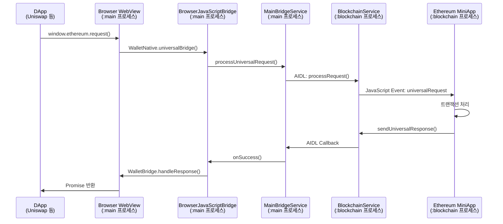
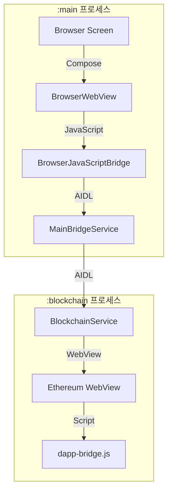

# Browser & Universal Bridge API Documentation

## 개요

ANAM Wallet의 Browser는 일반 웹 브라우징과 블록체인 DApp 연동을 동시에 지원하는 통합 브라우저입니다. Universal Bridge v2.0을 통해 Native 코드 수정 없이 JavaScript만으로 새로운 블록체인을 추가할 수 있습니다.

## DApp 개발자를 위한 사용 가이드

### 1. 지갑 연결하기

```javascript
// MetaMask 호환 인터페이스로 지갑 연결
const accounts = await window.ethereum.request({
  method: "eth_requestAccounts",
});
console.log("Connected account:", accounts[0]);

// 또는 EIP-6963 이벤트로 지갑 발견
window.addEventListener("eip6963:announceProvider", (event) => {
  const provider = event.detail.provider;
  const info = event.detail.info;
  console.log("Wallet found:", info.name);
});
```

### 2. 트랜잭션 전송하기

```javascript
// 트랜잭션 요청
const txHash = await window.ethereum.request({
  method: "eth_sendTransaction",
  params: [
    {
      from: accounts[0],
      to: "0x742d35Cc6634C0532925a3b844Bc9e7595f0bEb",
      value: "0x29a2241af62c0000", // 3 ETH in wei
      gas: "0x5208", // 21000
    },
  ],
});
console.log("Transaction sent:", txHash);
```

### 3. 지원되는 메서드

API는 EIP-1193 표준을 완벽하게 지원합니다.

**주요 메서드:**

- `eth_requestAccounts` - 계정 연결 요청
- `eth_accounts` - 연결된 계정 조회
- `eth_chainId` - 현재 체인 ID
- `eth_sendTransaction` - 트랜잭션 전송
- `personal_sign` - 메시지 서명
- `eth_signTypedData_v4` - 구조화된 데이터 서명
- `wallet_switchEthereumChain` - 네트워크 전환

## 아키텍처 및 흐름도

### 전체 동작 흐름



### 프로세스 간 통신 구조



## 핵심 구현 로직

### 1. JavaScript Bridge 구현

```kotlin
// BrowserJavaScriptBridge.kt
@JavascriptInterface
fun universalBridge(requestId: String, payload: String) {
    // 단순히 메시지만 전달 (우체부 역할)
    onUniversalRequest?.invoke(requestId, payload)
}

// 응답 전송 (Native → JavaScript)
fun sendUniversalResponse(requestId: String, response: String) {
    val base64Response = Base64.encodeToString(
        response.toByteArray(),
        Base64.NO_WRAP
    )

    val script = """
        window.WalletBridge.handleResponse('$requestId',
            JSON.parse(atob('$base64Response'))
        );
    """
    webView?.evaluateJavascript(script, null)
}
```

### 2. AIDL 인터페이스

```aidl
// IUniversalCallback.aidl
interface IUniversalCallback {
    void onSuccess(String requestId, String responseData);
    void onError(String requestId, String errorData);
}

// IMainBridgeService.aidl
interface IMainBridgeService {
    void processUniversalRequest(
        String requestId,
        String payload,
        IUniversalCallback callback
    );
}
```

### 3. DApp Bridge 스크립트 구현

```javascript
// dapp-bridge.js - 블록체인별로 구현
window.WalletBridge = {
  request: function (requestId, payload) {
    return new Promise((resolve, reject) => {
      // Native 호출
      window.WalletNative.universalBridge(requestId, payload);

      // 콜백 저장
      this._callbacks[requestId] = { resolve, reject };

      // 타임아웃 설정
      setTimeout(() => {
        if (this._callbacks[requestId]) {
          reject({ code: -32000, message: "Timeout" });
          delete this._callbacks[requestId];
        }
      }, 30000);
    });
  },

  handleResponse: function (requestId, response) {
    const callback = this._callbacks[requestId];
    if (callback) {
      if (response.error) {
        callback.reject(response.error);
      } else {
        callback.resolve(response);
      }
      delete this._callbacks[requestId];
    }
  },
};

// EIP-1193 Provider 구현
window.ethereum = {
  request: async function ({ method, params }) {
    const requestId = `eth_${Date.now()}_${Math.random()}`;
    const payload = JSON.stringify({
      type: "ethereum_rpc",
      method: method,
      params: params || [],
    });

    const response = await window.WalletBridge.request(requestId, payload);
    return response.result;
  },
};
```

### 4. 블록체인 미니앱에서 요청 처리

```javascript
// Ethereum 미니앱의 index.js
window.addEventListener("universalRequest", async (event) => {
  const { requestId, payload } = event.detail;
  const request = JSON.parse(payload);

  if (request.type === "ethereum_rpc") {
    handleDAppRequest(requestId, request.method, request.params);
  }
});

async function handleDAppRequest(requestId, method, params) {
  try {
    let result;

    switch (method) {
      case "eth_requestAccounts":
        result = [currentWallet.address];
        break;

      case "eth_sendTransaction":
        const tx = params[0];
        result = await adapter.sendTransaction(tx);
        break;

      // ... 다른 메서드들
    }

    sendDAppResponse(requestId, result);
  } catch (error) {
    sendDAppError(requestId, error.code, error.message);
  }
}
```

## Universal Bridge v2.0 특징

### 아키텍처 원칙

**"Native는 우체부, JavaScript가 모든 것을 제어"**

- Native는 메시지 전달만 담당 (50줄 이하)
- 모든 블록체인 로직은 JavaScript에서 구현
- ZIP 파일만으로 새 블록체인 추가 가능

### 지원 블록체인

| 블록체인 | 표준               | 파일 크기 | 상태    |
| -------- | ------------------ | --------- | ------- |
| Ethereum | EIP-1193, EIP-6963 | 15KB      | ✅ 지원 |
| Bitcoin  | -                  | 12KB      | ✅ 지원 |
| Solana   | Wallet Standard    | 18KB      | 🔜 예정 |
| Cosmos   | -                  | -         | 🔜 예정 |

### manifest.json 구조

```json
{
  "app_id": "com.anam.ethereum",
  "type": "blockchain",
  "name": "ethereum",
  "version": "1.0.0",
  "icon": "assets/icons/app_icon.png",
  "pages": ["pages/index/index"],
  "permissions": ["transaction"],
  "bridge": {
    "script": "bridge/dapp-bridge.js",
    "timeout": 30000
  }
}
```

## 에러 처리

### 에러 케이스

1. **블록체인 미연결**: "BlockchainService not connected"
2. **지갑 없음**: "No wallet found"
3. **사용자 거부**: Code 4001 - "User rejected"
4. **네트워크 오류**: Code -32603 - "Internal error"
5. **타임아웃**: Code -32000 - "Request timeout"

### 에러 처리 예시

```javascript
try {
  const accounts = await window.ethereum.request({
    method: "eth_requestAccounts",
  });
} catch (error) {
  if (error.code === 4001) {
    // 사용자가 연결을 거부함
    console.log("User rejected connection");
  } else if (error.code === -32000) {
    // 타임아웃
    console.log("Request timed out");
  } else {
    console.error("Unknown error:", error);
  }
}
```

## 북마크 기능

### 북마크 추가/제거

Browser는 일반 웹 브라우징을 위한 북마크 기능을 제공합니다.

```kotlin
// 북마크 토글
fun toggleBookmark() {
    viewModelScope.launch {
        toggleBookmarkUseCase(title, url)
        _effect.emit(
            if (isBookmarked) Effect.BookmarkRemoved
            else Effect.BookmarkAdded
        )
    }
}
```

### 북마크 저장 구조

```kotlin
// DataStore에 JSON 배열로 저장
[
    {
        "id": "uuid",
        "title": "Uniswap",
        "url": "https://app.uniswap.org",
        "timestamp": 1234567890
    }
]
```

## 기술 스택

- **WebView**: Android WebView (Chrome 기반)
- **JavaScript Bridge**: @JavascriptInterface
- **AIDL**: 프로세스 간 통신
- **Jetpack Compose**: UI 구성
- **Kotlin Coroutines**: 비동기 처리
- **DataStore**: 북마크 저장

## 보안 고려사항

1. **프로세스 격리**: Browser와 Blockchain 프로세스 분리
2. **메시지 검증**: 모든 요청에 requestId 포함
3. **타임아웃 설정**: 30초 후 자동 실패 처리
4. **Base64 인코딩**: JSON 이스케이프 문제 방지
5. **단방향 통신**: JavaScript → Native만 @JavascriptInterface 노출

## 제한사항

- 한 번에 하나의 블록체인만 활성화 가능
- 트랜잭션 처리 중 블록체인 전환 불가
- WebView 특성상 일부 웹사이트 호환성 문제 가능

## 실제 사용 예시 - Uniswap 연동

### DApp 연결 및 스왑 실행

Uniswap에서 토큰 스왑을 실행하는 전체 플로우입니다.

#### 1. 지갑 연결

```javascript
// Uniswap이 지갑 연결 요청
const provider = window.ethereum;
const accounts = await provider.request({
  method: "eth_requestAccounts",
});

// AnamWallet이 계정 반환
// → ["0x742d35Cc6634C0532925a3b844Bc9e7595f0bEb"]
```

#### 2. 네트워크 확인

```javascript
// 현재 네트워크 확인
const chainId = await provider.request({
  method: "eth_chainId",
});

// Sepolia 테스트넷인 경우
// → "0xaa36a7" (11155111)
```

#### 3. 스왑 트랜잭션 실행

```javascript
// Uniswap Router를 통한 스왑
const txHash = await provider.request({
  method: "eth_sendTransaction",
  params: [
    {
      from: accounts[0],
      to: "0x68b3465833fb72A70ecDF485E0e4C7bD8665Fc45", // Uniswap Router
      data: "0x5ae401dc...", // 스왑 함수 calldata
      value: "0x0",
      gas: "0x493e0",
    },
  ],
});

// 트랜잭션 해시 반환
// → "0x123abc..."
```

### 전체 사용 플로우

1. **Browser 탭 선택** → Browser 화면 진입
2. **URL 입력** → app.uniswap.org 접속
3. **Connect Wallet 클릭** → AnamWallet 자동 감지
4. **계정 연결 승인** → Ethereum 미니앱에서 처리
5. **토큰 선택 및 수량 입력** → Uniswap UI
6. **Swap 실행** → 트랜잭션 서명 요청
7. **트랜잭션 완료** → 블록체인에 기록
