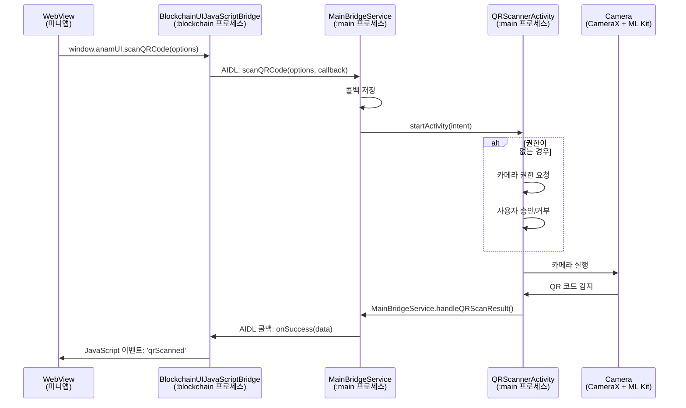
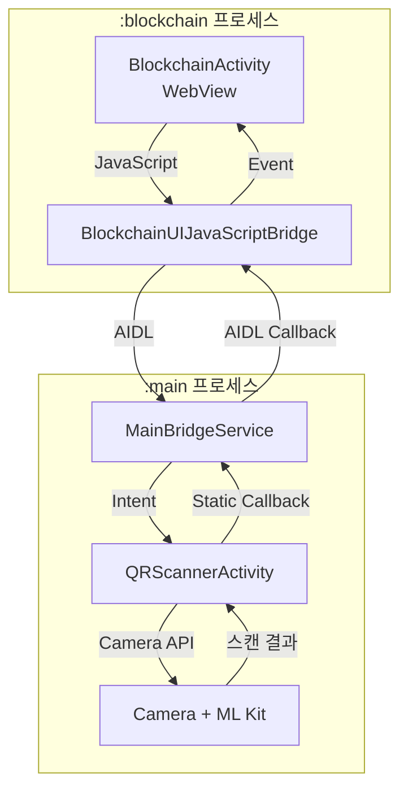

# QR Scanner API Documentation

## 개요

ANAM Wallet의 QR Scanner API는 블록체인 미니앱에서 QR 코드를 스캔하여 데이터를 읽을 수 있는 기능을 제공합니다. 메인 프로세스에서 카메라를 실행하고, 스캔된 데이터를 미니앱으로 전달하는 구조로 구현되어 있습니다.

## 미니앱 개발자를 위한 사용 가이드

### 1. QR Scanner 호출하기

```javascript
// QR Scanner 호출
window.anamUI.scanQRCode(
  JSON.stringify({
    title: "QR 코드 스캔", // 선택사항: 스캐너 화면 제목
    description: "지갑 주소 또는 개인키 QR 코드를 스캔하세요", // 선택사항: 설명 텍스트
  })
);
```

### 2. 스캔 결과 받기

```javascript
// 이벤트 리스너 등록
window.addEventListener("qrScanned", function (event) {
  if (event.detail.success) {
    // 스캔 성공
    const qrData = event.detail.data; // 스캔된 원본 데이터
    console.log("QR Data:", qrData);

    // 데이터 파싱은 미니앱에서 처리
    // 예: Ethereum 주소, JSON 데이터, URL 등
  } else {
    // 스캔 실패 또는 취소
    const error = event.detail.error;
    console.error("Scan failed:", error);
  }
});
```

### 3. 반환 데이터 형식

API는 QR 코드의 원본 데이터를 그대로 반환합니다. 데이터 파싱은 미니앱에서 처리해야 합니다.

**예시:**

- `"0x1234567890abcdef..."` - Ethereum 주소
- `"bitcoin:1A1zP1eP5QGefi2DMPTfTL5SLmv7DivfNa"` - Bitcoin URI
- `'{"type":"wallet","address":"0x..."}'` - JSON 데이터
- `"https://example.com/wallet/0x1234"` - URL

## 아키텍처 및 흐름도

### 전체 동작 흐름



### 프로세스 간 통신 구조



## 핵심 구현 로직

### 1. JavaScript Bridge 구현

```kotlin
// BlockchainUIJavaScriptBridge.kt
@JavascriptInterface
fun scanQRCode(optionsJson: String) {
    // MainBridgeService로 AIDL 호출
    mainBridgeService.scanQRCode(optionsJson, object : IQRScannerCallback.Stub() {
        override fun onSuccess(qrData: String) {
            // JavaScript 이벤트 발생
            sendQRScanResult(true, qrData, null)
        }

        override fun onError(errorMessage: String) {
            sendQRScanResult(false, null, errorMessage)
        }
    })
}
```

### 2. AIDL 인터페이스

```aidl
// IQRScannerCallback.aidl
interface IQRScannerCallback {
    void onSuccess(String qrData);
    void onError(String errorMessage);
}

// IMainBridgeService.aidl
interface IMainBridgeService {
    void scanQRCode(String options, IQRScannerCallback callback);
}
```

### 3. 정적 콜백 처리

```kotlin
// MainBridgeService.kt
companion object {
    @Volatile
    private var qrScannerCallback: IQRScannerCallback? = null

    fun handleQRScanResult(success: Boolean, data: String) {
        qrScannerCallback?.let { callback ->
            if (success) {
                callback.onSuccess(data)
            } else {
                callback.onError(data)
            }
            qrScannerCallback = null // 콜백 해제
        }
    }
}
```

### 4. 카메라 권한 처리

```kotlin
// QRScannerActivity.kt
private val requestPermissionLauncher = registerForActivityResult(
    ActivityResultContracts.RequestPermission()
) { isGranted ->
    if (isGranted) {
        setupQRScanner() // 권한 승인 시 스캐너 시작
    } else {
        MainBridgeService.handleQRScanResult(false, "Camera permission is required")
        finish()
    }
}
```

### 5. QR 코드 감지

```kotlin
// ML Kit Barcode Scanner 사용
private fun processImageProxy(imageProxy: ImageProxy, onQRCodeScanned: (String) -> Unit) {
    val scanner = BarcodeScanning.getClient()
    val image = InputImage.fromMediaImage(mediaImage, imageProxy.imageInfo.rotationDegrees)

    scanner.process(image)
        .addOnSuccessListener { barcodes ->
            for (barcode in barcodes) {
                barcode.rawValue?.let { value ->
                    onQRCodeScanned(value)
                }
            }
        }
}
```

## 에러 처리

### 에러 케이스

1. **카메라 권한 거부**: "Camera permission is required"
2. **사용자 취소**: "QR scan cancelled by user"
3. **서비스 연결 실패**: "Service not connected"
4. **카메라 오류**: Camera binding 실패 시

### 에러 처리 예시

```javascript
window.addEventListener("qrScanned", function (event) {
  if (!event.detail.success) {
    switch (event.detail.error) {
      case "Camera permission is required":
        alert("카메라 권한이 필요합니다.");
        break;
      case "QR scan cancelled by user":
        // 사용자가 취소함
        break;
      default:
        console.error("QR scan error:", event.detail.error);
    }
  }
});
```

## 기술 스택

- **Android CameraX**: 카메라 제어
- **ML Kit Barcode Scanning**: QR 코드 인식
- **AIDL**: 프로세스 간 통신
- **Jetpack Compose**: UI 구성

## 보안 고려사항

1. **프로세스 격리**: 블록체인 프로세스와 메인 프로세스 분리
2. **권한 관리**: 카메라 권한은 사용자 승인 필요
3. **데이터 검증**: 스캔된 데이터는 미니앱에서 검증 필요

## 제한사항

- 카메라 권한이 필수
- Android 기기에서만 동작
- 한 번에 하나의 QR 코드만 스캔 가능

## 실제 사용 예시 - Ethereum 미니앱

### QR 스캔 후 자동 송금 화면 이동

Ethereum 미니앱에서는 QR 코드 스캔 후 자동으로 Send 페이지로 이동하고 주소를 입력하는 기능을 제공합니다.

#### 1. QR 데이터 분석 및 자동 처리

```javascript
// index.js - QR 데이터 분석
function analyzeQRData(data) {
  // 이더리움 주소 감지 시 Send 페이지로 자동 이동
  if (data.startsWith("0x") && data.length === 42) {
    navigateToSendWithAddress(data);
    return;
  }

  // Ethereum URI 형식 처리
  if (data.startsWith("ethereum:")) {
    const address = data.split(":")[1].split("?")[0];
    navigateToSendWithAddress(address);
    return;
  }
}
```

#### 2. 주소와 함께 Send 페이지 이동

```javascript
// index.js - Send 페이지로 이동하며 주소 전달
function navigateToSendWithAddress(address) {
  console.log("Navigating to send page with address:", address);

  // URL 파라미터로 주소 전달
  window.anamUI.navigateTo(
    `pages/send/send?address=${encodeURIComponent(address)}`
  );
}
```

#### 3. Send 페이지에서 자동 입력

```javascript
// send.js - URL 파라미터에서 주소 추출 및 자동 입력
function checkUrlParameters() {
  const urlParams = new URLSearchParams(window.location.search);
  const address = urlParams.get("address");

  if (address) {
    // 주소 입력란에 자동 입력
    document.getElementById("recipient-address").value = address;

    // 사용자에게 알림
    showToast("QR 코드에서 주소를 가져왔습니다");

    // 금액 입력란으로 포커스 이동
    document.getElementById("send-amount").focus();
  }
}
```

### 지원하는 QR 데이터 형식 및 자동 처리

| 형식          | 예시                                  | 자동 처리                         |
| ------------- | ------------------------------------- | --------------------------------- |
| Ethereum 주소 | `0x1234567890abcdef...`               | Send 페이지 이동 + 주소 자동 입력 |
| Ethereum URI  | `ethereum:0x1234...?amount=0.1`       | Send 페이지 이동 + 주소 자동 입력 |
| 개인키        | 64자 hex 문자열                       | 보안 경고 표시                    |
| JSON 데이터   | `{"type":"wallet","address":"0x..."}` | 파싱 후 처리                      |
| URL           | `https://example.com/wallet/0x1234`   | URL 파싱                          |

### 전체 사용 플로우

1. **QR 버튼 클릭** → 카메라 실행
2. **QR 코드 스캔** → 이더리움 주소 감지
3. **자동 페이지 이동** → Send 페이지로 전환
4. **주소 자동 입력** → 받는 사람 주소란 채움
5. **금액 입력** → 사용자는 금액만 입력
6. **전송** → 트랜잭션 실행
